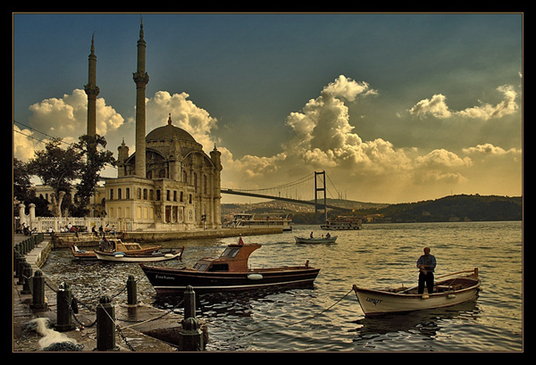

JSresolutionImg
===============

According to the resolution show photos, jQuery Plugin

#Examples

```javascript

//for all (img[options-attributes]) images 

$(document).resolutionImg({
			"980" : '980-src',
			"1024" : '1024-src',
			"1980" : '1980-src'
});
			


//for selectors (img[options-attributes]) in all images
$('div#resize').resolutionImg({
			"980" : '980-src',
			"1024" : '1024-src',
			"1980" : '1980-src'
});

```

#Html Code

```html
<!-- only for selective -->
<div id="resize">
	
</div>
```
